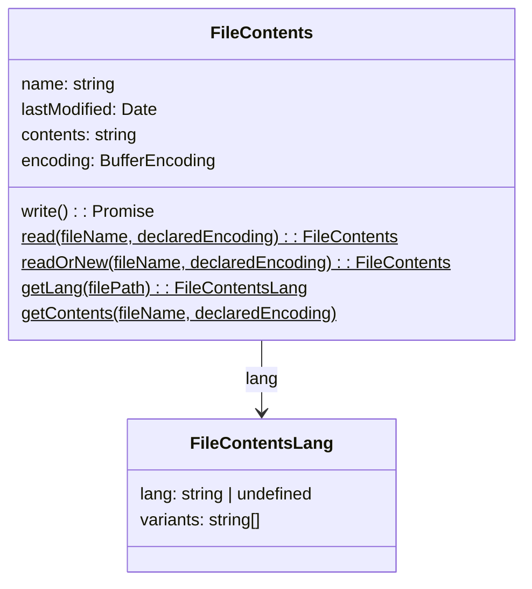

# fileutil
File utilities.

## Data types

### FileContents
Represents a file with contents, either instantiated programmatically:
```js
new FileContents()
```
or from the file system
```js
FileContents.read("path/someFile.xxx")
```


- `static read(fileName, declaredEncoding)` creates FileContents from a file path.
- `static readOrNew(fileName, declaredEncoding)` reads a file or instantiate a brand new SsgFile if it doesn't exist.
- `static getLang(filePath): SsgFileLang` guesses a file language and its language file variants in the same directory.
- `static getContents(fileName, declaredEncoding)` gets the text contents of a file, and how it is encoded.
- `write()` writes the file contents according to its encoding.

`FileContentsLang` represents a file language and the detected file variants.

An `HtmlFileContents` is available from [ssg-api](https://github.com/Javarome/ssg-api/blob/main/src/file/HtmlFileContents.test.ts).

## Functions

- `toBufferEncoding (encoding)` ccnverts encoding names to Node's buffer encoding names.
- `detectEncoding (filePath)` detects the encoding of some file contents.
- `detectContentsEncoding (buffer)` detects the encoding of some contents.
- `ensureDirectoryOf (filePath)` checks if a directory exists and, if not, creates it.
- `writeFile (filePath, contents, encoding)` writes a file. If the file directory doesn't exit, it is created.
- `subDirs (fromDir): Promise<Dirent[]` gets a list of subdirectories.
- `subDirsNames (fromDir): Promise<string[]>` gets a list of subdirectories' names.
- `findDirs (fromDirs, excludedDirs): Promise<string[]>` finds directories under a set of dirs.
- `findDirsContaining (fileName, exclude?): Promise<string[]>` finds directories containing a file (but other).
- `findSubDirs (ofDir, excludedDirs = []): Promise<string[]>` finds subdirectories of a dir.
- `copy (toDir, sourcePatterns, options): Promise<string[]>` copies files to a destination directory.
- `copyFiles (sourceFiles, toDir) {): string[]` copies multiple files to a directory.
- `copyFile (sourceFilePath, destDir): string` copies a file to a directory.

## Import
For instance:
```js
import { FileContents, copy } from "@javarome/fileutil"
```
